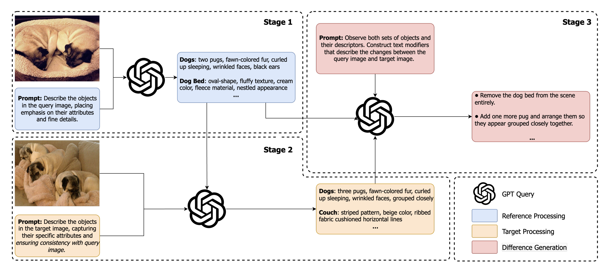
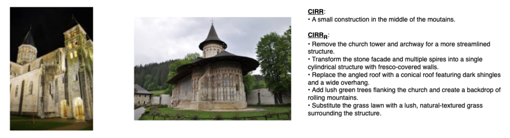
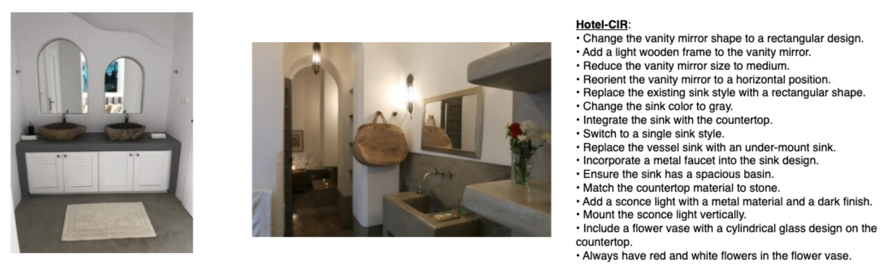

# good4cir

## Overview

**<u>good4cir</u>** is a GPT-4o powered data generation pipeline used for creating synthetic composed image retrieval datasets. It uses a three-stage prompting strategy to overcome the limitations of vison-language models: hallucination and lack of fine-grained captioning. For more information, please see our [CVPR 25' SyntaGen Workshop paper](https://arxiv.org/abs/2503.17871) *"good4cir: Generating Detailed Synthetic Captions for Composed Image Retrieval"*.



## Datasets

We generate two composed image retrieval datasets to show the effectiveness of this approach in both general and fine-grained domains: CIRR<sub>R</sub> and Hotel-CIR. 

**<u>CIRR<sub>R</sub></u>**: We generate a new set of captions for the [CIRR](https://github.com/Cuberick-Orion/CIRR) dataset using the good4cir pipeline.

**Note**: The CIRR<sub>R</sub> dataset does not contain rewritten captions for all original CIRR examples.

[Download](https://drive.google.com/drive/folders/15P3RKfajeLJHuehm3HAiPWM5a7HGZuxv?usp=sharing)

**Example:**


**<u>Hotel-CIR</u>**: We synthesize a composed image retrieval dataset for the hotels-domain, a domain of low intra-class variance that requires the identification of fine-grained differences. 

[Download](https://drive.google.com/drive/folders/1eyIv76JiV5E4bABkhxqKzJwnLBflyzoW?usp=sharing)

**Example:**


## Usage

Under the `src/` directory, we provide scripts that will help you generate new CIR datasets for your specified data domains. 

### Dependencies

Please install all dependencies defined in the `requirements.txt` file using the following command:

```
pip install -r requirements.txt
```

### Required Files and Directories

You will need to define the following variables in the `run.py` file:

`output_dir`: provide the full path to an empty directory where information regarding individual API requests will be maintained.

`api_key_file`: provide the full path to the `.txt` file containing your OpenAI API key. 

`dataset_file`: provide the full path to the `.json` file containing your target and refereance image pairs that will be used to create the CIR dataset. Your dataset file should be structured as follows: 

```
{
    "reference_image": "https://cs.slu.edu/~trafficcam_data/48/4815/14267323_481589.jpg",
    "target_image": "https://cs.slu.edu/~trafficcam_data/22/2243/10386267_224390.jpg"
}
```

For every entry in the `.json` file, ensure that the first key is labeled `reference_image` followed by the reference image url the second key is labeled `target_image` followed by the target image url.

**Note**: Images must be accessible via url for this pipeline to run. 

### Prompts

We provide general prompts that may work across various data domains, but we encourage you to modify the prompts for all stages to best fit your use case.

### Post Processing

While the output from the model is not always consistent, the `CIRDatasetGenerator.py` file includes post-processing logic to extract the cleaned dataset into a `dataset.json` file. However, the included code works best when you prompt the model at stage 3 to *"format all difference captions as a list of sentences ending in periods."* For ease of use, please maintain this in your own constructed prompts. After cleanup, each entry in the `dataset.json` file should look similar to the following: 

```
{
    "reference_image": "https://cs.slu.edu/~trafficcam_data/48/4815/14267322_481589.jpg",
    "target_image": "https://cs.slu.edu/~trafficcam_data/34/3496/11409753_349683.jpg",
    "difference_captions": [
        "Change the color tone of the walls to an off-white color to create a consistent and seamless look throughout the space.",
        "Remove the sculpture from its current display and replace it with a compact-sized sink with an off-white circular basin for a more functional appearance.",
        "Introduce a hanging system to display white bathroom towels, ensuring they have a folded appearance to maintain neatness.",
        "Replace the intricate ornamental details of the sculpture with a simpler, basic design element for a more minimalist appearance.",
        "Transition from the heavy, dark-colored curtains to a lighter, off-white design that harmonizes with the rest of the space.",
        "Upgrade the spotlight to feature a chrome metal finish for consistency with other metal fixtures like the sink faucet.",
        "Remove any visible chairs and incorporate compact and space-efficient bathroom fixtures to enhance the functionality of the area."
    ]
}
```

### Run

Run the `run.py` script using the following command:

```
python run.py
```


 


